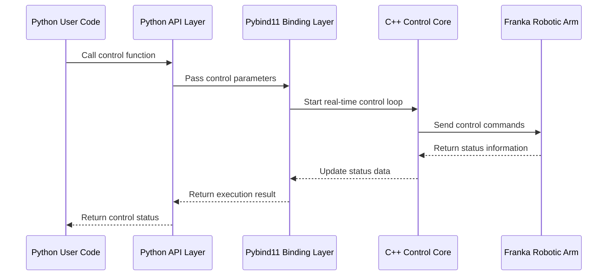
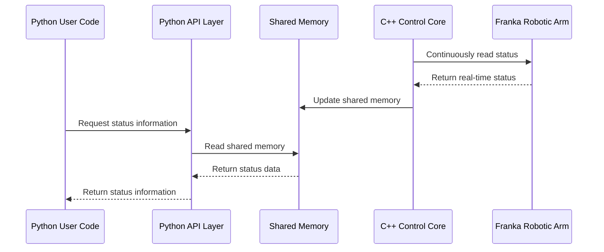
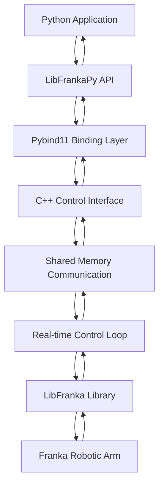
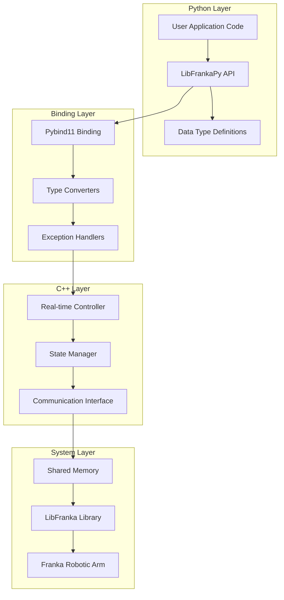

# LibFrankaPy Product Requirements Document

## 1. Product Overview

LibFrankaPy is a Python binding project for the libfranka C++ library, designed to provide high-level Python interfaces for Franka robotic arms while maintaining the performance advantages of low-level C++ real-time control. <mcreference link="https://github.com/frankarobotics/libfranka" index="0">0</mcreference>

This project addresses the technical barriers that Python developers face when needing to directly use C++ libraries to control Franka robotic arms. Through hybrid architecture design, it ensures both real-time performance and Python usability.

The goal is to become the core foundational library in the Franka robotic arm Python ecosystem, supporting both research and industrial application scenarios.

## 2. Core Functions

### 2.1 User Roles

| Role | Usage Method | Core Permissions |
|------|--------------|------------------|
| Robot Researcher | Direct installation and use | Can perform robotic arm control, trajectory planning, state monitoring |
| Industrial Developer | Integration into application systems | Can develop automation applications, integrate into production systems |

### 2.2 Functional Modules

Our libfrankapy requirements include the following main functional modules:

1. **Python Binding Interface**: pybind11 binding layer, data type conversion, exception handling
2. **Real-time Control Core**: C++ real-time control loop, callback function management, state synchronization
3. **High-level Python API**: Robotic arm control interface, trajectory planning interface, state query interface
4. **Communication Layer**: Shared memory communication, data structure definition, thread safety mechanisms

### 2.3 Functional Details

| Module Name | Sub-module | Function Description |
|-------------|------------|----------------------|
| Python Binding Interface | Pybind11 Binding Layer | Use pybind11 to expose C++ classes and functions to Python, handle data type conversion and memory management |
| Python Binding Interface | Exception Handling | Convert C++ exceptions to Python exceptions, provide error information and debugging support |
| Real-time Control Core | C++ Control Loop | Implement robot.control() callback at C++ layer, ensure real-time performance requirements |
| Real-time Control Core | State Synchronization | Real-time update of robotic arm state information, including joint angles, torques, end-effector poses, etc. |
| High-level Python API | Robotic Arm Control | Provide motion control interfaces for joint space and Cartesian space |
| High-level Python API | Trajectory Planning | Support trajectory parameter setting, path planning, motion constraint configuration |
| High-level Python API | State Query | Obtain real-time state information, including joint state, pose, torque, etc. |
| Communication Layer | Shared Memory | Implement efficient data exchange between Python and C++ |
| Communication Layer | Thread Safety | Ensure data consistency and safety in multi-threaded environments |

## 3. Core Processes

### 3.1 Robotic Arm Control Process

### 3.2 Status Monitoring Process

### Main User Operation Flows:

**Researcher Usage Flow:**
1. Initialize robotic arm connection
2. Set control parameters and safety limits
3. Send motion targets (joint angles or end-effector poses)
4. Monitor execution status and feedback
5. Handle exceptions and emergency stops

**Developer Integration Flow:**
1. Import libfrankapy library
2. Configure robotic arm parameters
3. Start real-time control loop
4. Send control commands through API
5. Receive status feedback for application logic

## 4. User Interface Design

### 4.1 Design Style

- **API Design Style**: Clean and intuitive Python style, following PEP 8 standards
- **Documentation Style**: Clear code examples and API documentation, supporting Sphinx generation
- **Error Handling**: Detailed exception information and debugging hints
- **Naming Convention**: Use snake_case naming, consistent with Python ecosystem
- **Type Hints**: Complete type annotation support for IDE intelligent prompts

### 4.2 API Interface Design

| Interface Category | Interface Name | Design Elements |
|-------------------|----------------|----------------|
| Connection Management | FrankaRobot class | Simple constructor supporting IP address and configuration parameters |
| Motion Control | move_to_joint() | Intuitive parameter naming, supporting velocity and acceleration limits |
| Status Query | get_state() | Returns structured status object containing all key information |
| Trajectory Control | execute_trajectory() | Supports multiple trajectory formats, provides progress callbacks |
| Safety Control | emergency_stop() | Immediate response emergency stop functionality |

### 4.3 Platform Adaptation

This project is specifically designed for Ubuntu 22.04+ real-time kernel PREEMPT_RT platform, without considering cross-platform compatibility, focusing on real-time performance optimization. <mcreference link="https://github.com/frankarobotics/libfranka" index="0">0</mcreference>

## 5. Technical Architecture

### 5.1 Architecture Overview

### 5.2 Key Technology Selection

| Technology Component | Selected Solution | Selection Rationale |
|----------------------|-------------------|--------------------||
| Python Binding | Pybind11 | Excellent performance, supports modern C++ features, easy to maintain |
| Real-time Communication | Shared Memory | Low latency, high throughput, suitable for real-time control |
| Build System | CMake | Cross-platform support, compatible with libfranka |
| Package Management | setuptools | Python standard packaging tool, easy to distribute |
| Documentation Generation | Sphinx | Python ecosystem standard, supports automatic API documentation |
| Testing Framework | pytest | Python standard testing framework, comprehensive functionality |
