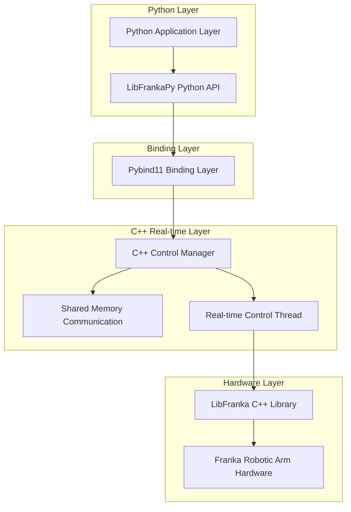
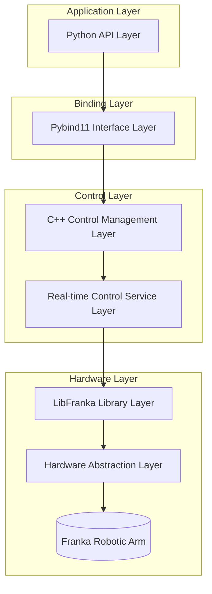
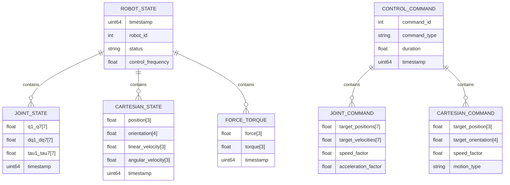

# LibFrankaPy Technical Architecture Document

## 1. Architecture Design



## 2. Technical Description

* **Python Layer**: Python\@3.8+ + numpy + typing

* **Binding Layer**: pybind11\@2.10+

* **C++ Real-time Layer**: C++17 + libfranka\@0.15+ + pthread + rt library

* **Build System**: CMake\@3.16+ + setuptools

* **Dependencies**: Eigen3 + Poco + fmt + pinocchio

## 3. Route Definition

| Module Path            | Function Description |
| ---------------------- | -------------------- |
| libfrankapy.robot      | Main robotic arm control interface |
| libfrankapy.control    | Motion control and trajectory planning |
| libfrankapy.state      | Status query and monitoring |
| libfrankapy.exceptions | Exception handling and error management |
| libfrankapy.utils      | Utility functions and data conversion |

## 4. API Definition

### 4.1 Core API

**Robotic Arm Connection Management**

```python
class FrankaRobot:
    def __init__(self, robot_ip: str, realtime_config: Optional[RealtimeConfig] = None)
    def connect() -> bool
    def disconnect() -> None
    def is_connected() -> bool
```

**Motion Control Interface**

```python
def move_to_joint(self, joint_positions: List[float],
                  speed_factor: float = 0.1,
                  acceleration_factor: float = 0.1) -> bool

def move_to_pose(self, target_pose: List[float],
                 speed_factor: float = 0.1) -> bool

def execute_trajectory(self, trajectory: Trajectory,
                      callback: Optional[Callable] = None) -> bool
```

**Status Query Interface**

```python
def get_joint_state() -> JointState
def get_cartesian_pose() -> CartesianPose
def get_robot_state() -> RobotState
def get_joint_torques() -> List[float]
```

**Data Structure Definition**

```python
@dataclass
class JointState:
    positions: List[float]  # 7 joint angles
    velocities: List[float] # 7 joint velocities
    efforts: List[float]    # 7 joint torques
    timestamp: float

@dataclass
class CartesianPose:
    position: List[float]   # [x, y, z]
    orientation: List[float] # [qx, qy, qz, qw] quaternion
    timestamp: float

@dataclass
class RealtimeConfig:
    control_frequency: int = 1000  # Hz
    filter_cutoff: float = 100.0   # Hz
    safety_limits: SafetyLimits
```

## 5. Server Architecture Diagram



## 6. Data Model

### 6.1 Data Model Definition



### 6.2 Shared Memory Data Structure

**Real-time State Shared Memory Structure**

```cpp
// Real-time state data structure (C++)
struct RealtimeState {
    std::atomic<uint64_t> timestamp;
    std::atomic<bool> is_valid;

    // Joint state
    std::array<std::atomic<double>, 7> joint_positions;
    std::array<std::atomic<double>, 7> joint_velocities;
    std::array<std::atomic<double>, 7> joint_torques;

    // Cartesian state
    std::array<std::atomic<double>, 3> cartesian_position;
    std::array<std::atomic<double>, 4> cartesian_orientation;

    // Force/torque
    std::array<std::atomic<double>, 6> external_wrench;

    // Control state
    std::atomic<int> control_mode;
    std::atomic<bool> emergency_stop;
};

// Control command data structure
struct ControlCommand {
    std::atomic<uint64_t> command_id;
    std::atomic<int> command_type;
    std::atomic<bool> new_command;

    // Joint control commands
    std::array<std::atomic<double>, 7> target_joint_positions;
    std::atomic<double> joint_speed_factor;
    std::atomic<double> joint_acceleration_factor;

    // Cartesian control commands
    std::array<std::atomic<double>, 3> target_cartesian_position;
    std::array<std::atomic<double>, 4> target_cartesian_orientation;
    std::atomic<double> cartesian_speed_factor;
};
```

**Initialization Configuration**

```cpp
// Create shared memory segment
int shm_fd = shm_open("/libfrankapy_state", O_CREAT | O_RDWR, 0666);
ftruncate(shm_fd, sizeof(RealtimeState));
RealtimeState* shared_state = (RealtimeState*)mmap(0, sizeof(RealtimeState),
                                                   PROT_READ | PROT_WRITE,
                                                   MAP_SHARED, shm_fd, 0);

// Initialize atomic variables
new(shared_state) RealtimeState();
shared_state->timestamp.store(0);
shared_state->is_valid.store(false);
shared_state->emergency_stop.store(false);

// Set real-time thread priority
struct sched_param param;
param.sched_priority = 80;
pthread_setschedparam(pthread_self(), SCHED_FIFO, &param);
```
